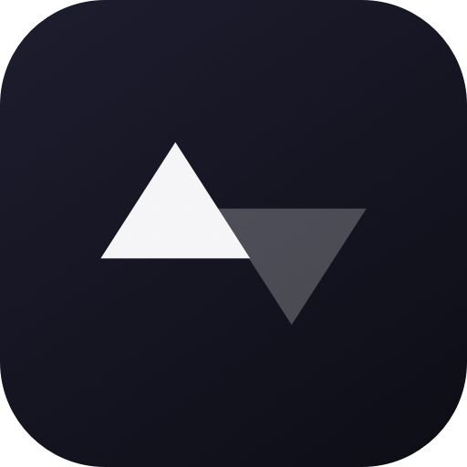

<p align="center">
  <br>
  
  <br>
</p>

<h1 align="center">upto</h1>

<p align="center">
  macOS menu bar app that monitors the health of your favourite services.
</p>

<p align="center">
  
  
  
</p>

## Features

- **Status at a glance** — color-coded triangle in your menu bar (green/orange/red/gray)
- **Multi-provider** — supports Atlassian Statuspage, RSS feeds, and Google Cloud status
- **Default services** — ships with Claude, OpenAI, xAI/Grok, and Google/Gemini
- **Add any service** — paste a status page URL and upto auto-detects the provider
- **Component breakdown** — see individual component status for each service
- **Hover actions** — open status page or remove a service on hover
- **Pulse indicator** — breathing status dot for each monitored service
- **Notifications** — subtle alerts when a service changes state
- **Light & dark mode** — follows system appearance
- **60s polling** — automatic refresh with manual refresh button

## Install

Download the latest `.dmg` from [Releases](https://github.com/neethanwu/upto/releases), open it, and drag **UpTo.app** to Applications.

> upto runs as a menu bar app — look for the triangle icon in your menu bar after launching.

## Build from Source

Requires **Xcode 16+** and **macOS 14+**.

```bash
git clone https://github.com/neethanwu/upto.git
cd upto

# Run locally (ad-hoc signed)
make run

# Or build a release bundle
make build
make bundle
```

### Signed Release Build

If you have a Developer ID certificate:

```bash
# Set your signing identity
export SIGN_IDENTITY="Developer ID Application: Your Name (TEAMID)"

# Build, sign, create DMG, and notarize
make release
```

## How It Works

upto polls status page APIs every 60 seconds and aggregates health across all monitored services. Each provider type has a dedicated parser:

- **Atlassian Statuspage** — fetches `/api/v2/summary.json` (Claude, OpenAI, GitHub, etc.)
- **RSS feeds** — parses XML feeds for incident status (xAI/Grok)
- **Google Cloud** — filters `/incidents.json` for Gemini/Vertex AI products

The menu bar icon reflects the worst status across all services. Notifications fire on state transitions.

## Project Structure

```
UpTo/
├── UpToApp.swift                  # App entry, MenuBarExtra setup
├── Models/
│   ├── ServiceStatus.swift        # HealthStatus, MonitoredService, ProviderType
│   └── StatusMonitor.swift        # Observable poller, notifications, persistence
├── Providers/
│   ├── StatusProvider.swift       # Provider protocol
│   ├── AtlassianProvider.swift    # Atlassian Statuspage JSON parser
│   ├── XAIProvider.swift          # RSS/XML feed parser
│   └── GoogleCloudProvider.swift  # Google Cloud incidents parser
├── Views/
│   ├── StatusPopoverView.swift    # Main popover layout, header, footer
│   ├── ServiceRowView.swift       # Service row with hover actions
│   └── AddServiceView.swift       # Inline URL input with auto-detection
└── Utilities/
    └── MenuBarIcon.swift          # Color-coded triangle icon renderer
```

## License

[MIT](LICENSE)
